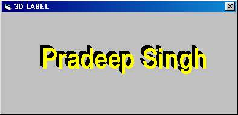



## A 3D Label ActiveX Control

### Description

3D Label ActiveX Control
 
### More Info
 

             |
---                |---
**Submitted On**   |2001-10-09 12:00:38
**By**             |[Suresh Singh](https://github.com/Planet-Source-Code/PSCIndex/blob/master/ByAuthor/suresh-singh.md)
**Level**          |Beginner
**User Rating**    |3.8 (23 globes from 6 users)
**Compatibility**  |VB 6\.0
**Category**       |[OLE/ COM/ DCOM/ Active\-X](https://github.com/Planet-Source-Code/PSCIndex/blob/master/ByCategory/ole-com-dcom-active-x__1-29.md)
**World**          |[Visual Basic](https://github.com/Planet-Source-Code/PSCIndex/blob/master/ByWorld/visual-basic.md)
**Archive File**   |[A 3D Label280561092001\.zip](https://github.com/Planet-Source-Code/suresh-singh-a-3d-label-activex-control__1-24972/archive/master.zip)

